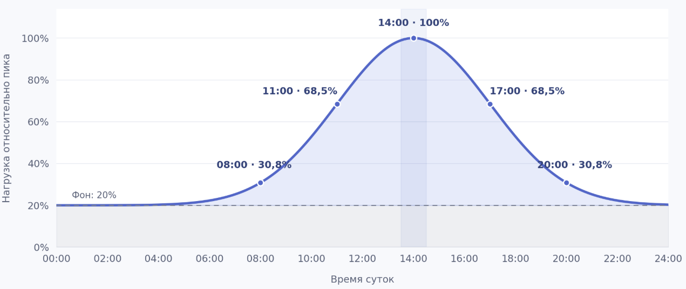

# Паспорт проекта

## Компания и продукт

Yandex

Observability платформа Monium

https://monium.yandex.cloud

## Тип цифрового бизнеса

Тип: SaaS

Модель монетизации: Pay-per-use

## Годовой оборот и способ подтверждения

Мы тарифицируем пользователей: 
- по использованию метрик (объем хранения шт, величина потока на запись шт\с)
- по записи логов \ трейсов в секунду (объем ГБ)
- по числу вычисляемых алертов и сработавших эскалаций

У нас не публикуется фин. статистика по отдельным сервисам, но публикуются тарифы https://yandex.cloud/ru/docs/monium/pricing и нагрузка (ниже в разделе Пользователи и нагрузка расписал)

Так что можно примерно прикинь выручку, брал опубликованные значения как пиковые, профиль нагрузки рассматривал примерно такой:

Посчитал по тарифам, общая выручка получилась около 15 млрд\год

Но при этом большая часть нагрузки это внутренняя нагрузка, так что прямая прибыль сервиса сильно меньше.

## Выбранный ИТ-сервис

Сервис квотирования - это наш сервис который отвечает за управления всеми доступными пользователю квотами. Этот сервис хранит эти квоты и предоставляет API другим сервисам, для их изменения + получения текущих лимитов и юзаджа. 

На данный момент квота сервис отвечает за квотирование исключительно метрик.

## Пользователи и нагрузка

По сути сервисом опосредовано пользуются все, как и внешние клиенты, которые записывают в нас телеметрию, так и соседнии с нами сервисы, для того чтобы ограничивать те или иные потоки данных исходящие от клиентов на основе выставленных для них лимитов.

MAU 16.000 пользователей

3.000.000.000 семплов метрик в секунду

44.000.000 миллионов спанов в секунду

60ГБ/c обрабатываем логов

Не уверен что я по NDA могу разглашать точные цифры, поэтому брал то что выложено в паблик https://yandex.ru/jobs/services/cloud/monium

## Критичность выгрузки

Сам по себе сервис никого не биллит, и деньги не собирает, но тем не менее он напрямую влияет на то, сможет ли пользователь прямо сейчас записать в свой проект какие то метрики.

Так что точную долю оценить сложно, но если оценивать грубо, то вся прибыль сервиса касающаяся метрик зависит от него, так как в самом худшем сценарии при нарушении работы квотирования пользователи могут потерять возможность записывать телеметрию, а значит и тарифицировать их мы перестанем и перестанем зарабатывать деньги.

Получается что доля выручки проходящей через QS - это вся доля выручки метрик, т.е. порядка 60%

## Команда и роли

Примерная команда сервисе 67 человека

Поделены на 5 бекенд команд (примерно по 9 человек), одну UI команду (10 человек), одну DevOps команду (3 человека), и одну продуктовую команду (7 человек)

## Стек и инфраструктура

Из платформ - только веб.

С размещением интереснее, у нас несколько инсталляций:
- внутрянка - это железная инсталляция
- облако - Yandex cloud

Внешних зависимостей у самого продукта огромное кол-во но из наиболее критичных можно выделить: сервисы авторизации, биллинг, телефония, база данных, топики.

Конкретно у сервисы квотирования зависимостей сильно меньше: база данных YDB, топики для доставки сообщений об изменениях в control-plane сущностях, наш соседний сервис - Project Manager для получения данных о проектах.

## Часы обслуживания

У нас есть дежурство, там уровень - mission critical, это значит что мы должны отреагировать в любое время суток в течении 10 минут на инциденты.
В поддержке у нас SLA на ответы нет, либо для меня эта информация закрыта, найти данные я не смог.
Часовые пояса пользователей у нас по сути никак не ограничены, так что сервис используется круглосуточно.

## Режим данных

Наши данные - это телеметрия, мы занимаемся ее сбором (свои агенты, фетчеры), приемкой (инжест), обработкой (временные рядя, логи, трейсы) и выстраиванием платформы поверх этих данных (считаем алерты, SLO, рисуем дашики, графики, итд итп). Это если говорить про весь продукт в целом.

Конкретно в QS данные телеметрии мы не храним и не обрабатываем, тут данные - это деревья квот, где по каждому проекту, шарду мы храним узлы с потреблением и лимитами квот.

## Ограничение и NDA

Всего перечислить пока не могу, потому что не знаю всего объема работы в рамках курса, но на данный момент из такого встретилось:

1. Данные по использованию сервиса (взял примерные данные из публичных источников)
2. Финансовая статистика конкретно по нашему сервису (заменил своими рассчетами на основе публичных данных)

## Источники

Ссылки прямо в тексте пунктов.