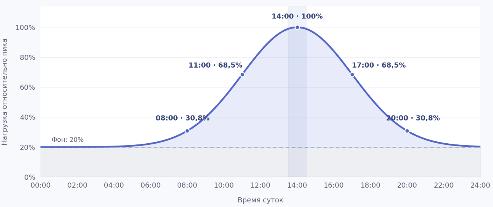

# ПР2

> **Важно: это учебный проект.** В материалах используются общедоступные сведения о Яндексе (Yandex), Yandex Cloud и Monium со ссылками на публичные источники. Оговорка о вымышленности не распространяется на сведения, прямо подтверждённые этими источниками. Все остальные конкретные данные — цены и тарифы, правила, требования, ограничения, показатели, состав команд, архитектура, процессы, SLA/SLO, сроки и компенсации — являются вымышленными условиями учебного сценария. Авторские расчёты, оценки, таблицы и иллюстрации на основе публичных данных также являются учебными и не подтверждают реальные показатели или обязательства компании и сервиса. Материалы не являются официальной документацией или заявлениями Яндекса, Yandex Cloud и Monium. Формулировки «мы», «наш сервис» и подобные относятся к участникам учебного сценария.

## Паспорт

### Компания и продукт

Yandex

Observability платформа Monium

https://monium.yandex.cloud

### Тип цифрового бизнеса

Тип: SaaS

Модель монетизации: Pay-per-use

### Выбранный ИТ-сервис

Сервис квотирования - это наш сервис который отвечает за управления всеми доступными пользователю квотами. Этот сервис хранит эти квоты и предоставляет API другим сервисам, для их изменения + получения текущих лимитов и юзаджа. 

На данный момент квота сервис отвечает за квотирование исключительно метрик.

### Годовой оборот и способ подтверждения

Мы тарифицируем пользователей: 
- по использованию метрик (объем хранения шт, величина потока на запись шт\с)
- по записи логов \ трейсов в секунду (объем ГБ)
- по числу вычисляемых алертов и сработавших эскалаций

Для учебного расчёта используются [публичные тарифы Monium](https://yandex.cloud/ru/docs/monium/pricing) и опубликованные показатели нагрузки (см. раздел «Пользователи и нагрузка»). Сам расчёт и его допущения являются авторской учебной моделью.

Для условной оценки выручки опубликованные значения приняты за пиковые. Это допущение учебного расчёта; предполагаемый профиль нагрузки представлен на иллюстрации:

Расчёт по публичным тарифам с принятым учебным профилем нагрузки даёт условную выручку около 15 млрд в год. Это результат авторской модели, а не опубликованная финансовая статистика или подтверждённая реальная выручка Monium.

### Пользователи и нагрузка

По сути сервисом опосредовано пользуются все, как и внешние клиенты, которые записывают в нас телеметрию, так и соседнии с нами сервисы, для того чтобы ограничивать те или иные потоки данных исходящие от клиентов на основе выставленных для них лимитов.

MAU 16.000 пользователей

3.000.000.000 семплов метрик в секунду

44.000.000 миллионов спанов в секунду

60ГБ/c обрабатываем логов

Источник показателей пользователей и нагрузки: [публичная страница команды Monium](https://yandex.ru/jobs/services/cloud/monium). Использование этих показателей как пиковых в расчёте выручки — отдельное учебное допущение.

### Режим данных

Наши данные - это телеметрия, мы занимаемся ее сбором (свои агенты, фетчеры), приемкой (инжест), обработкой (временные рядя, логи, трейсы) и выстраиванием платформы поверх этих данных (считаем алерты, SLO, рисуем дашики, графики, итд итп). Это если говорить про весь продукт в целом.

Конкретно в QS данные телеметрии мы не храним и не обрабатываем, тут данные - это деревья квот, где по каждому проекту, шарду мы храним узлы с потреблением и лимитами квот.

## Регламент

### Incident management 

#### Матрица приоритетов по инцидентам

| Влияние ↓ / Срочность → | Высокая: работа остановлена, обхода нет | Средняя: работа ограничена, есть временный обход | Низкая: можно отложить без роста потерь |
| --- | --- | --- | --- |
| Высокое: много пользователей, значимая доля выручки | P1 | P2 | P3 |
| Среднее: часть пользователей, ограниченная доля выручки | P2 | P3 | P4 |
| Низкое: единичные пользователи, без существенного влияния на выручку | P3 | P4 | P4 |
| Всегда P1: массовая недоступность Read API, нарушение гарантий записи или отставание записи потребления более часа | P1 | P1 | P1 |

#### Порядок реакции и оповещения:

Дежурный по сервису реагирует на поступившее обращение уровня P1 или P2 в течении 10 минут. После оценки угрозы, если она подтверждается, дежурный заводит инцидент, который сразу вывешивается на публичной доске доступности сервиса. 

#### Переходы по статусам

1. При заведени, инцидент получает статус "Расследование" и ETA на выяснение причин - 15 минут для P1 и P2; Для P3 и ниже инцидент не заводится;

2. После обнаружение причины главная цель - снять импакт. Инцидент переводится в статус "Работы по восстановлению". ETA на восстановление работы сервиса 45 минут для P1, 1:45 для P2;

3. После снятие импакта и восстановление работы сервиса инцидент переводится в статус. "Сервис восстановлен". Дежурный должен заполнить данные по инциденту:
    - Затронутые зоны доступности
    - Страдали ли пользователи
    - Страдали ли внешние пользователи
    - Таймлайн
    - Затронутые сервисы-потребители
    - Причины инцидента
ETA на заполнение инцидента 2 дня; 

4. После заполнения инцидента внутри SRE команды проводится обсуждение и большинством голосов решается необходим ли дополнительный разбор инциденту на LSR. Для P1 разбор обязателен. В случае необходимости дополнительного разбора он переводится в статус "Ждет разбора", ETA на разбор 5 дней; Команда должна собраться обсудить причины и сформулировать список Action Item-ов для предотвращения подобных проблем в будущем. ETA на выполнение AI утверждаются с командой владельцем сервиса, после чего фиксируются в тикете, дальнейшую ответственность за них несет лид команды.

5. Инцидент переводится в статус "Закрыт" после формулировки AI или после восстановления сервиса, если SRE команда решила что причины ясны и доп разбор не нужен.

### Service request management

#### Каталог запросов

- Выгрузка логов по отчетности для биллинга, выполняется дежурным, ETA на выполнение 3 часа.
Ограничение по окну на выгрузку - 30 дней;

### Change enablement

##### Запросы на изменение

1. Стандартные (предодобренные)

Формулируются product owner-ом в начале каждого квартала в виде проектов.

У каждого проекта существует "Цель", то для чего проект создавался;

DoD - объективные, проверяемые требования обозначающие что цель проекта достигнута;

"Отвественный" - разработчик \ менеджер ответсвенный за то, чтобы цель была достигнута;

Дедлайн - к какой дате цель должна быть выполнена;

Опционально - декомпозиция по задачам.

2. Обычные (требующие согласование)

Поступают от внутренних пользователей \ сервисов в виде Feature-Request (FF) - специально оформленных задач, в которых описаны:

1. Цель + DoD
2. Мотивация к изменениям

Разбор FF идёт в несколько этапов:

1. Маршрутизация по командам Менеджером продукта;
2. Обработка внутри команды и присвоение одного из статусов:
    - Берем в работу - будет закрыто в этом сезоне, обязательное указание исполнителя;
    - Беклог - FF интересен и согласуется с целями команды но текущего капасити не хватает;
    - Не будет исправлено - FF не корректный \ не согласуется с целями команды, в этом случае обязательно обоснование от команды в виде комментария.

Также могут поступать от команды SRE в формате запросов на повышение наблюдаемости системы.

3. Срочные 

- Формулируются в процессе расследования инцидента, как решение проблемы, с которой столкнулся сервис. Решение о применении изменений остается за дежурным.

- Формулируются в результате разбора обращения на уровне L3 (см. Problem management). Решении о применении остается за лидом команды. 

### Problem management

Проблемами считаются обращения приоритетами P3 и P4. Для них повышено время реакции и восстановление, а также не требуется заведение инцидента и разбор последствий.

Проблемы поступают через очередь обращений и проходят через поддержку:

L1 - Решение максимально типовых вопросов, нет взаимодействия с кодом сервиса, помощь с документацией и с процессами описаными в них;

L2 - Решение проблем требующих небольшого расследования, понимания работы системы изнутри. Решение не описано в документации \ документация некорректна;

L3 - Решение проблем на уровне разработчиков системы. Проблема требует глубокого погружения во внутреннее устройство \ требует изменений в исходном коде.

По результатам разбора проблемы может быть один из следующих исходов:

1. Проблема решена без необходимости изменений в системе \ документации;
2. Проблема решена, найден ворк-эраунд, но необходима доработка в системе \ документации. Исходное обращение закрывается со статусом "Будем исправлено", формирует запрос на изменение и линкуется к обращению сотрудниками поддержки;
3. Проблема не решена, необходима доработка в системе. Исходное обращение остается открытым, создается запрос на изменение с высоким приоритетом и линкуется к обращению;

### Monitoring and event management

#### Алертинг

На узлы сервиса заводятся SLO отслеживающие определенный показатель системы:

- <список из SLA документа>

На каждое SLO заводится алерт на быстрое сгорание, SLO на быстрое сгорание вызывает эскалацию, на наиболее критичные узлы системы "primary" на менее критичные "secondary".

Алерты также могут быть заведены на показатели метрик:

- <примеры из sla документа>

#### Эскалации

- secondary - менее критичные проблемы, которые потенциально могут подождать решения. Сообщение в общий чат с алертами, в нем всегда находится текущий дежурный и реагирует на него в рабочее время в порядке критичности (критичность дежурный оценивает сам по поведению системы)

- primary - наиболее критичные проблемы требующие немедленной реакции. Выполняется звонок дежурному в любое время, по истечении времени реакции (10 минут), звонок выполняется лиду команды, по истечении времени реакции (10 минут) звонок выполняется лиду сервиса.

### Service level management

Задачами по анализу мониторинга занимается дежурный SRE. Он не занимается реакцией на инциденты \ обращения пользователей. Задача его заключается в анализе регулярно звонящих алертов \ постоянно плавящихся SLO, анализу покрытия сервисов.

1. Если алерт срабатывает более чем 70% времени находится в состоянии (Alarm), при этом влияние на систему не выявлено то дежурный имеет право его замьютить, а также должен завести задачу на разбор причин.

2. Если SLO плавится постоянно при это на текущий момент показатели системы поднять нельзя, и такое поведение является ожидаемым, то дежурный должен завести задачу на пересмотр SLO с указанием текущих показателей системы и целевых. На следующей регулярной встрече по пересмотру условия могут быть снижены чтобы удовлетворять текущим, либо заведена новая задача с запросом на изменения в системе, такие задачи относятся к категории проблем.

3. При обнаружении в ходе работы над инцидентом \ разборе существующих мониторов потенциально не покрытой области сервиса заводится задача на команду разработки для повышения наблюдаемости. Такие обращения относятся к категории "Обычные"

### Capacity and performance management

В SLA у нас зафиксированы следующие показатели:

- Чтение 400к RPS, запись 5к RPS; допустимый пик чтения 600к RPS длительностью 1 час.
- Успешные Read-запросы: p95 ≤ 200ms, p99 ≤ 500ms; Write-запросы: p95 ≤ 1s, p99 ≤ 5s. Окно расчёта: месяц.

Чтобы держать эти показатели, надо проверять QS и YDB под такой нагрузкой и заранее закладывать запас железа. В ходе обновления и переконфигурации пропускная способность QS сильно пострадает из-за уменьшения объема железа, так что отдельно надо проверить, выдержит ли оставшаяся часть сервиса нагрузку. Если запаса не хватит, на пике начнут расти задержки и таймауты, а значит будут плавиться SLO.

### Deployment management

По SLA доступность Read API ≥ 99.9%, Write API ≥ 99%. Плановые работы: отсутствуют, релизы катаются непрерывно.

В [сценарии с обновлением библиотеки](swans.md#второй-этап) внешние клиенты два часа получают ошибки авторизации, а месячная доступность Read API проседает ниже цели 99.9%. Получается что сама выкатка может привести к нарушению SLA.

Поэтому обновления проводим поэтапно, по репликам или зонам доступности, перед выкаткой проверяем новую версию на тестовом окружении. После каждого этапа проверяем доступность API, если по мониторам все плохо - дальше выкатку не продолжаем. Это нужно чтобы обновление одной части сервиса не привело к даунтайму всего сервиса целиком.

## Роли

### Service owner

В текущем регламенте это ответственность лида сервиса.

- **Операционные:** следит за выполнением обязательств сервиса, выделяет исполнителей и ресурсы на задачи. При инциденте подключается если есть риск не уложиться в восстановление, потерять данные или надолго оставить пользователей без сервиса; помогает привлечь владельцев зависимостей.
- **Стратегические:** согласует приоритеты развития QS, цели квартальных проектов и необходимый запас железа, выделяет капасити на Action Item-ы и улучшение практик.
- **Полномочия:** самостоятельно распределяет уже выделенные ресурсы. Дополнительный бюджет выносит на согласование руководству Monium; изменение SLA согласует с заказчиком через Service level manager.

### Incident manager

В текущем регламенте эту роль выполняет дежурный по сервису, для замещения назначается резервный Incident manager.

- **Операционные:** регулярно проверяет открытые инциденты и их ETA. При P1 или P2 реагирует в течении 10 минут, после подтверждения угрозы заводит инцидент на публичной доске, привлекает технических специалистов. Главная цель - снять импакт. Обновляет статус раз в 10 минут, после восстановления заполняет данные по инциденту за 2 дня.
- **Стратегические:** разбирает нарушения времени реакции и восстановления, предлагает изменения в порядке эскалаций и передает повторяющиеся причины в Problem management.
- **Полномочия:** определяет приоритет по матрице, меняет статус и ETA, координирует восстановление. Изменения применяет по решению Change authority; эти роли может совмещать один человек. Риск нарушения сроков восстановления, потери данных или длительного влияния эскалирует Service owner. Разбор P1 отменить самостоятельно не может.

### Service desk agent

Это специалисты с линии L1.

- **Операционные:** разбирает очередь, решает максимально типовые вопросы, помогает с документацией. Для P3/P4 отвечает за первый ответ с подтверждением принятия в работу в течение 1 часа в рабочие часы и маршрутизацию обращения. Запрос на выгрузку логов передает исполнителю, контролирует ETA 3 часа и окно выгрузки до 30 дней. При признаках P1 или P2 сразу привлекает Incident manager и связывает обращения пользователей с инцидентом.
- **Стратегические:** собирает повторяющиеся вопросы, предлагает дополнения в документацию, каталог запросов и автоматизацию типовых действий.
- **Полномочия:** самостоятельно решает вопросы по готовым инструкциям и закрывает выполненные обращения. Если решения в документации нет - передает на L2, затем при необходимости на L3. Запросы за пределами каталога передает Service owner; изменения в проде не согласует.

### Technical specialist

В текущем регламенте это исполнители на L2 и L3, разработчики и дежурный в части работы с самой системой.

- **Операционные:** расследует проблемы, для которых нужно понимание системы изнутри, выполняет выгрузку логов и согласованные изменения. При инциденте ищет причину, предлагает ворк-эраунд, восстанавливает сервис и передает результаты Incident manager.
- **Стратегические:** исправляет причины повторных сбоев, выполняет Action Item-ы, дорабатывает тесты, документацию и наблюдаемость системы.
- **Полномочия:** самостоятельно проводит диагностику и выполняет действия по утвержденному порядку. Если требуется изменение вне этого порядка - обращается к Change authority; если нужны другая команда или дополнительные ресурсы - сообщает Incident manager либо Service owner.

### Problem manager

Эту роль выполняет дежурный SRE команды, при необходимости подключается руководитель SRE команды

- **Операционные:** регулярно разбирает повторные обращения и инциденты, связывает их с общей причиной, фиксирует найденные ворк-эраунды. При инциденте помогает известными решениями; после восстановления организует разбор, для P1 - обязательный, контролирует исполнителей и ETA по Action Item-ам.
- **Стратегические:** анализирует тренды по причинам сбоев, предлагает доработки чтобы подобные проблемы не повторялись, проверяет результат уже выполненных Action Item-ов.
- **Полномочия:** заводит записи о проблемах и задачи на расследование, фиксирует известные ошибки. Изменения передает Change authority, нехватку капасити на исправление - Service owner. Найденный ворк-эраунд сам по себе не означает что причина устранена.

### Change coordinator

В текущем регламенте маршрутизацией FF занимается менеджер продукта.

- **Операционные:** проверяет наличие цели, DoD, мотивации, ответственного и сроков, маршрутизирует запросы по командам, фиксирует принятые решения. Отправляет клиентам уведомления о работах и отвечает за сроки: S - не менее чем за сутки, M - не менее чем за 3 дня, L - не менее чем за неделю. При инциденте помогает оформить срочное изменение и передать его на согласование.
- **Стратегические:** анализирует задержки в согласовании, пересечения работ и неудачные изменения, предлагает улучшения в порядке обработки запросов.
- **Полномочия:** может вернуть неполный запрос на доработку и организовать его разбор. Решение о применении остается за Change authority; конфликт приоритетов или ресурсов передается Service owner. Статус "Берем в работу" сам по себе не заменяет разрешение на выкатку.

### Change authority

Эту роль может выполнять один человек или команда. Для обычных изменений решение принимает команда, для срочных в ходе инцидента - дежурный по сервису, для изменений по результатам L3 - лид команды.

- **Операционные:** оценивает влияние изменений, проверяет готовность и принимает решение о применении. При инциденте согласует срочные изменения для снятия импакта. Для стандартных изменений заранее утверждает порядок выполнения и условия, при которых повторное согласование не требуется.
- **Стратегические:** пересматривает перечень предодобренных изменений и границы полномочий на основе результатов выкаток и разборов инцидентов.
- **Полномочия:** разрешает или отклоняет изменение в пределах выделенных полномочий. Если нужны дополнительные ресурсы или влияние выходит за согласованные границы - подключает Service owner. Изменение условий SLA передает Service level manager для согласования с владельцем сервиса и заказчиком.

Уточнение к стандартным изменениям: квартальный проект сам по себе не является предодобренным изменением. Предодобряется конкретное действие с известным порядком выполнения, небольшим риском и понятными условиями применения; для остальных изменений внутри проекта нужно согласование.

### Monitoring and event management practitioner

Это задачи дежурного SRE по анализу мониторинга.

- **Операционные:** анализирует регулярно звонящие алерты, постоянно плавящиеся SLO и покрытие сервисов. При инциденте помогает графиками, логами и данными по сгоранию бюджета ошибок; восстановлением сервиса занимается Incident manager с техническими специалистами.
- **Стратегические:** анализирует шумные алерты и пропущенные события, заводит задачи на повышение наблюдаемости системы, предлагает изменения в настройках мониторинга.
- **Полномочия:** может замьютить алерт, который находится в Alarm более 70% времени, если влияние на систему не выявлено; обязательно заводит задачу на разбор причин. Реальную деградацию передает Incident manager, пересмотр SLO - Service level manager, доработки системы - через обычный запрос на изменение.

### Service level manager

Эту роль выполняют разработчики из SRE команды.

- **Операционные:** следит за выполнением SLA и собирает данные для отчетности. При инциденте фиксирует какие обязательства затронуты и помогает оценить риск их нарушения, после восстановления включает фактические показатели в отчет.
- **Стратегические:** анализирует тренды по доступности и времени ответа, готовит ежемесячный пересмотр SLA, сопоставляет ожидания потребителей с возможностями сервиса.
- **Полномочия:** запрашивает данные и готовит предложения по изменению SLA/SLO. Самостоятельно снижать цели не может: решение согласуется с Service owner и заказчиком. Если SLO постоянно плавится, на пересмотр выносится либо изменение цели, либо задача на доработку системы.

### Capacity and performance manager

Эту роль выполняет руководитель SRE команды.

- **Операционные:** следит за RPS, задержками QS и YDB, загрузкой ресурсов, организует нагрузочные проверки. При инциденте помогает найти ограничение по мощности и оценить, выдержит ли оставшаяся часть сервиса нагрузку.
- **Стратегические:** анализирует рост потребления, планирует запас железа под пик чтения 600к RPS на час и работу во время обновлений, заранее заводит задачи на расширение ёмкости.
- **Полномочия:** проводит проверки в тестовом окружении и готовит расчет необходимых ресурсов. Дополнительное железо согласует с Service owner, изменения в проде - с Change authority; при текущей деградации привлекает Incident manager.

### Deployment manager

Эту роль выполняет дежурный devops команды.

- **Операционные:** перед каждой выкаткой проверяет согласование, результаты тестов, порядок обновления реплик и зон доступности. Организует выкатку и проверки после каждого этапа. При инциденте останавливает дальнейшую выкатку и координирует согласованное исправление с Incident manager и техническими специалистами.
- **Стратегические:** разбирает неудачные выкатки, улучшает проверки и автоматизацию чтобы обновление одной части сервиса не приводило к даунтайму всего сервиса целиком.
- **Полномочия:** самостоятельно останавливает выкатку если по мониторам все плохо. Выполняет согласованный план; изменение плана или исправление вне него передает Change authority. При подтвержденном влиянии на пользователей привлекает Incident manager.

### Customer

Это уполномоченный представитель команды-потребителя QS; 

- **Операционные:** формулирует требования и FF, уточняет цели и DoD. При инциденте предоставляет технические данные и контакт, помогает определить влияние на пользователей и проверить восстановление своего сценария.
- **Стратегические:** сообщает о планируемом росте нагрузки и новых сценариях использования, согласует необходимые уровни обслуживания и приоритеты доработок.
- **Полномочия:** принимает решения по требованиям и подтверждает результат в пределах ответственности своей команды. Изменения в QS передает через Change coordinator, новые условия SLA согласует с Service owner и Service level manager; обязательства за пределами своих полномочий выносит руководству своей команды.

## Соответствие SLA, практик и ролей

### Доступность и производительность

| Параметр SLA | Практика ITIL | Роль и действия |
| --- | --- | --- |
| Доступность Read API ≥ 99.9%, Write API ≥ 99%. Отчетный период - месяц, отдельно по каждой зоне доступности. Работы и отказы зависимостей учитываются в доступности. | Service level management | Service level manager - сравнивает фактические показатели с целями SLA, фиксирует нарушения в отчете. |
| Успешные Read-запросы: p95 ≤ 200ms, p99 ≤ 500ms; Write-запросы: p95 ≤ 1s, p99 ≤ 5s. Окно расчета - месяц. | Capacity and performance management; Monitoring and event management | Capacity and performance manager - организует нагрузочные проверки; Monitoring and event management practitioner - анализирует задержки. |
| Чтение 400к RPS, запись 5к RPS; допустимый пик чтения 600к RPS длительностью 1 час. | Capacity and performance management | Capacity and performance manager - проводит нагрузочные проверки и планирует запас железа; Service owner - выделяет ресурсы. |
| Обновления потребления: не менее 99.9% записаны в БД в течение одного часа после отправки. Окно расчета - месяц. | Monitoring and event management; Service level management | Monitoring and event management practitioner - анализирует алерты и сгорание бюджета ошибок; Service level manager - фиксирует выполнение SLO в месячном отчете. |
| Надежность записи потребления: не менее 99.9% записей без искажений со стороны QS. Окно расчета - месяц; бюджет ошибок - 0.1% записей за месяц. | Monitoring and event management; Service level management | Monitoring and event management practitioner - анализирует алерты и сгорание бюджета ошибок; Service level manager - фиксирует выполнение SLO в месячном отчете. |

### Мониторинг

| Параметр SLA | Практика ITIL | Роль и действия |
| --- | --- | --- |
| Окно расчета алертов на доступность - 5 минут. | Monitoring and event management | Monitoring and event management practitioner - проверяет окно в настройках алертов. |
| Алерт на отставание учета потребления: доля обновлений, не записанных в течение часа, достигает 1.5% за окно 5 минут. Учитываются обновления, для которых часовой срок истек в этом окне. | Monitoring and event management; Incident management | Monitoring and event management practitioner - анализирует срабатывания и пропущенные события; Incident manager - реагирует на сигнал. |
| Алерт на искажения записи: доля записей с расхождениями превышает 1.5% за окно 5 минут, отдельно по каждой зоне доступности. | Monitoring and event management; Incident management | Monitoring and event management practitioner - анализирует срабатывания и пропущенные события; Incident manager - реагирует на сигнал. |

### Поддержка и разбор инцидентов

| Параметр SLA | Практика ITIL | Роль и действия |
| --- | --- | --- |
| P1: реакция ≤ 10 минут, восстановление 1 час. | Incident management | Incident manager - реагирует и координирует восстановление; Technical specialist - проводит диагностику и снимает импакт. |
| P2: реакция 10 минут, восстановление 2 часа. | Incident management | Incident manager - реагирует и координирует восстановление; Technical specialist - проводит диагностику и снимает импакт. |
| P3: реакция 1 час, решение 6 часов. | Problem management | Service desk agent - первый ответ и маршрутизация; Technical specialist - расследование и решение обращений на L2/L3. |
| P4: реакция 1 час, решение 24 часа. | Problem management; Service request management | Service desk agent - первый ответ, типовое решение или передача на L2/L3; Technical specialist - расследование и решение переданных обращений. |
| P1/P2 - 24x7. P3/P4 - рабочие часы: 08:00–18:00 по часовому поясу клиента, без выходных и праздников. | Service level management | Service owner - выделяет исполнителей на дежурства и поддержку в согласованные часы. |
| Обновления статуса - каждые 10 минут для P1 и P2. При трудностях ETA обновляется с уведомлением пользователя. | Incident management | Incident manager - обновляет статус и ETA, уведомляет пользователей. |
| Разбор причин и план действий предоставляются в течение недели после восстановления. | Problem management | Problem manager - организует разбор и фиксирует план действий; Technical specialist - передает результаты расследования. |

### Работы и уведомления

| Параметр SLA | Практика ITIL | Роль и действия |
| --- | --- | --- |
| S: единовременно затронута часть зон, работы не дольше суток, частичная деградация некоторых API без полной недоступности. Уведомление не менее чем за сутки. | Change enablement; Deployment management | Change authority - оценивает импакт; Change coordinator - отправляет уведомление; Deployment manager - контролирует ход работ. |
| M: единовременно затронуты все зоны, работы не дольше суток, частичная деградация всех API без полной недоступности. Уведомление не менее чем за 3 дня. | Change enablement; Deployment management | Change authority - оценивает импакт; Change coordinator - отправляет уведомление; Deployment manager - контролирует ход работ. |
| L: полная недоступность некоторых API не дольше часа, в любых зонах. Уведомление не менее чем за неделю. | Change enablement; Deployment management | Change authority - оценивает импакт; Change coordinator - отправляет уведомление; Deployment manager - контролирует ход работ. |

### Компенсации и пересмотр SLA

| Параметр SLA | Практика ITIL | Роль и действия |
| --- | --- | --- |
| Кредит за доступность Read API: при достижении цели - 0%; при 99.5% ≤ A < целевого уровня - 10%; при 98% ≤ A < 99% - 20%; при A < 98% - 30%. | Service level management | Service level manager - фиксирует фактическую доступность и соответствующий размер кредита. |
| При нарушении срока уведомления или неверном расчете импакта кредит по фактическому размеру работ: S - 10%, M - 20%, L - 30% месячной стоимости затронутых услуг. | Service level management | Service level manager - фиксирует нарушение срока уведомления или расхождение по импакту и размер компенсации. |
| Регулярный пересмотр SLA - раз в месяц. | Service level management | Service level manager - готовит пересмотр; Service owner и Customer - согласуют условия. |
| Внеочередной пересмотр при росте нагрузки выше 120% от предыдущей целевой. | Capacity and performance management; Service level management | Capacity and performance manager - сообщает о превышении нагрузки; Service level manager - готовит пересмотр. |
| Изменения SLA согласуются за 2 недели до вступления в силу. Новые правила не меняют расчет завершенных периодов. | Service level management | Service level manager - готовит редакцию и фиксирует дату вступления в силу; Service owner и Customer - согласуют условия. |
